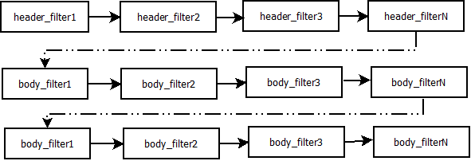
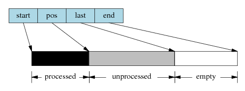

过滤模块 
======================

过滤模块简介 
------------------------

执行时间和内容 
+++++++++++++++++++++++++++

过滤（filter）模块是过滤响应头和内容的模块，可以对回复的头和内容进行处理。它的处理时间在获取回复内容之后，向用户发送响应之前。它的处理过程分为两个阶段，过滤HTTP回复的头部和主体，在这两个阶段可以分别对头部和主体进行修改。

在代码中有类似的函数：

```
		ngx_http_top_header_filter(r);
		ngx_http_top_body_filter(r, in);
```

就是分别对头部和主体进行过滤的函数。所有模块的响应内容要返回给客户端，都必须调用这两个接口。


执行顺序 
+++++++++++++++++++++

过滤模块的调用是有顺序的，它的顺序在编译的时候就决定了。控制编译的脚本位于auto/modules中，当你编译完Nginx以后，可以在objs目录下面看到一个ngx_modules.c的文件。打开这个文件，有类似的代码：

```

		ngx_module_t *ngx_modules[] = {
			...
			&ngx_http_write_filter_module,
			&ngx_http_header_filter_module,
			&ngx_http_chunked_filter_module,
			&ngx_http_range_header_filter_module,
			&ngx_http_gzip_filter_module,
			&ngx_http_postpone_filter_module,
			&ngx_http_ssi_filter_module,
			&ngx_http_charset_filter_module,
			&ngx_http_userid_filter_module,
			&ngx_http_headers_filter_module,
			&ngx_http_copy_filter_module,
			&ngx_http_range_body_filter_module,
			&ngx_http_not_modified_filter_module,
			NULL
		};
```

从write_filter到not_modified_filter，模块的执行顺序是反向的。也就是说最早执行的是not_modified_filter，然后各个模块依次执行。一般情况下，第三方过滤模块的config文件会将模块名追加到变量HTTP_AUX_FILTER_MODULES中，此时该模块只能加入到copy_filter和headers_filter模块之间执行。

Nginx执行的时候是怎么按照次序依次来执行各个过滤模块呢？它采用了一种很隐晦的方法，即通过局部的全局变量。比如，在每个filter模块，很可能看到如下代码：

```

		static ngx_http_output_header_filter_pt  ngx_http_next_header_filter;
		static ngx_http_output_body_filter_pt    ngx_http_next_body_filter;
		
		...

		ngx_http_next_header_filter = ngx_http_top_header_filter;
		ngx_http_top_header_filter = ngx_http_example_header_filter;

		ngx_http_next_body_filter = ngx_http_top_body_filter;
		ngx_http_top_body_filter = ngx_http_example_body_filter;
```

ngx_http_top_header_filter是一个全局变量。当编译进一个filter模块的时候，就被赋值为当前filter模块的处理函数。而ngx_http_next_header_filter是一个局部全局变量，它保存了编译前上一个filter模块的处理函数。所以整体看来，就像用全局变量组成的一条单向链表。

每个模块想执行下一个过滤函数，只要调用一下ngx_http_next_header_filter这个局部变量。而整个过滤模块链的入口，需要调用ngx_http_top_header_filter这个全局变量。ngx_http_top_body_filter的行为与header fitler类似。

响应头和响应体过滤函数的执行顺序如下所示：



这图只表示了head_filter和body_filter之间的执行顺序，在header_filter和body_filter处理函数之间，在body_filter处理函数之间，可能还有其他执行代码。

模块编译 
++++++++++++++++++++

Nginx可以方便的加入第三方的过滤模块。在过滤模块的目录里，首先需要加入config文件，文件的内容如下：

```
.. code:: c

		ngx_addon_name=ngx_http_example_filter_module
		HTTP_AUX_FILTER_MODULES="$HTTP_AUX_FILTER_MODULES ngx_http_example_filter_module"
		NGX_ADDON_SRCS="$NGX_ADDON_SRCS $ngx_addon_dir/ngx_http_example_filter_module.c"
```

说明把这个名为ngx_http_example_filter_module的过滤模块加入，ngx_http_example_filter_module.c是该模块的源代码。

注意HTTP_AUX_FILTER_MODULES这个变量与一般的内容处理模块不同。


过滤模块的分析 
--------------------------

相关结构体 
+++++++++++++++++++++
ngx_chain_t 结构非常简单，是一个单向链表：

```      
        typedef struct ngx_chain_s ngx_chain_t;
         
		struct ngx_chain_s {
			ngx_buf_t    *buf;
			ngx_chain_t  *next;
		};
```

在过滤模块中，所有输出的内容都是通过一条单向链表所组成。这种单向链表的设计，正好应和了Nginx流式的输出模式。每次Nginx都是读到一部分的内容，就放到链表，然后输出出去。这种设计的好处是简单，非阻塞，但是相应的问题就是跨链表的内容操作非常麻烦，如果需要跨链表，很多时候都只能缓存链表的内容。

单链表负载的就是ngx_buf_t，这个结构体使用非常广泛，先让我们看下该结构体的代码：

```

		struct ngx_buf_s {
			u_char          *pos;       /* 当前buffer真实内容的起始位置 */
			u_char          *last;      /* 当前buffer真实内容的结束位置 */
			off_t            file_pos;  /* 在文件中真实内容的起始位置   */
			off_t            file_last; /* 在文件中真实内容的结束位置   */

			u_char          *start;    /* buffer内存的开始分配的位置 */
			u_char          *end;      /* buffer内存的结束分配的位置 */
			ngx_buf_tag_t    tag;      /* buffer属于哪个模块的标志 */
			ngx_file_t      *file;     /* buffer所引用的文件 */

	 		/* 用来引用替换过后的buffer，以便当所有buffer输出以后，
			 * 这个影子buffer可以被释放。
			 */
			ngx_buf_t       *shadow; 

			/* the buf's content could be changed */
			unsigned         temporary:1;

			/*
			 * the buf's content is in a memory cache or in a read only memory
			 * and must not be changed
			 */
			unsigned         memory:1;

			/* the buf's content is mmap()ed and must not be changed */
			unsigned         mmap:1;

			unsigned         recycled:1; /* 内存可以被输出并回收 */
			unsigned         in_file:1;  /* buffer的内容在文件中 */
			/* 马上全部输出buffer的内容, gzip模块里面用得比较多 */
			unsigned         flush:1;
			/* 基本上是一段输出链的最后一个buffer带的标志，标示可以输出，
			 * 有些零长度的buffer也可以置该标志
			 */
			unsigned         sync:1;
			/* 所有请求里面最后一块buffer，包含子请求 */
			unsigned         last_buf:1;
			/* 当前请求输出链的最后一块buffer         */
			unsigned         last_in_chain:1;
			/* shadow链里面的最后buffer，可以释放buffer了 */
			unsigned         last_shadow:1;
			/* 是否是暂存文件 */
			unsigned         temp_file:1;

			/* 统计用，表示使用次数 */
			/* STUB */ int   num;
		};
```

一般buffer结构体可以表示一块内存，内存的起始和结束地址分别用start和end表示，pos和last表示实际的内容。如果内容已经处理过了，pos的位置就可以往后移动。如果读取到新的内容，last的位置就会往后移动。所以buffer可以在多次调用过程中使用。如果last等于end，就说明这块内存已经用完了。如果pos等于last，说明内存已经处理完了。下面是一个简单的示意图，说明buffer中指针的用法：




响应头过滤函数 
+++++++++++++++++++++++++

响应头过滤函数主要的用处就是处理HTTP响应的头，可以根据实际情况对于响应头进行修改或者添加删除。响应头过滤函数先于响应体过滤函数，而且只调用一次，所以一般可作过滤模块的初始化工作。

响应头过滤函数的入口只有一个：

```

		ngx_int_t
		ngx_http_send_header(ngx_http_request_t *r)
		{
			...

			return ngx_http_top_header_filter(r);
		}
```

该函数向客户端发送回复的时候调用，然后按前一节所述的执行顺序。该函数的返回值一般是NGX_OK，NGX_ERROR和NGX_AGAIN，分别表示处理成功，失败和未完成。

你可以把HTTP响应头的存储方式想象成一个hash表，在Nginx内部可以很方便地查找和修改各个响应头部，ngx_http_header_filter_module过滤模块把所有的HTTP头组合成一个完整的buffer，最终ngx_http_write_filter_module过滤模块把buffer输出。

按照前一节过滤模块的顺序，依次讲解如下：

=====================================  ================================================================================================================= 
filter module                           description
=====================================  =================================================================================================================
ngx_http_not_modified_filter_module    默认打开，如果请求的if-modified-since等于回复的last-modified间值，说明回复没有变化，清空所有回复的内容，返回304。
ngx_http_range_body_filter_module      默认打开，只是响应体过滤函数，支持range功能，如果请求包含range请求，那就只发送range请求的一段内容。
ngx_http_copy_filter_module            始终打开，只是响应体过滤函数， 主要工作是把文件中内容读到内存中，以便进行处理。
ngx_http_headers_filter_module         始终打开，可以设置expire和Cache-control头，可以添加任意名称的头
ngx_http_userid_filter_module          默认关闭，可以添加统计用的识别用户的cookie。
ngx_http_charset_filter_module         默认关闭，可以添加charset，也可以将内容从一种字符集转换到另外一种字符集，不支持多字节字符集。
ngx_http_ssi_filter_module             默认关闭，过滤SSI请求，可以发起子请求，去获取include进来的文件
ngx_http_postpone_filter_module        始终打开，用来将子请求和主请求的输出链合并
ngx_http_gzip_filter_module            默认关闭，支持流式的压缩内容
ngx_http_range_header_filter_module    默认打开，只是响应头过滤函数，用来解析range头，并产生range响应的头。
ngx_http_chunked_filter_module         默认打开，对于HTTP/1.1和缺少content-length的回复自动打开。
ngx_http_header_filter_module          始终打开，用来将所有header组成一个完整的HTTP头。
ngx_http_write_filter_module           始终打开，将输出链拷贝到r->out中，然后输出内容。
=====================================  ================================================================================================================= 


响应体过滤函数 
++++++++++++++++++++++++++

响应体过滤函数是过滤响应主体的函数。ngx_http_top_body_filter这个函数每个请求可能会被执行多次，它的入口函数是ngx_http_output_filter，比如：

```

        ngx_int_t
        ngx_http_output_filter(ngx_http_request_t *r, ngx_chain_t *in)
        {
            ngx_int_t          rc;
            ngx_connection_t  *c;

            c = r->connection;

            rc = ngx_http_top_body_filter(r, in);

            if (rc == NGX_ERROR) {
                /* NGX_ERROR may be returned by any filter */
                c->error = 1;
            }

            return rc;
        }
```

ngx_http_output_filter可以被一般的静态处理模块调用，也有可能是在upstream模块里面被调用，对于整个请求的处理阶段来说，他们处于的用处都是一样的，就是把响应内容过滤，然后发给客户端。

具体模块的响应体过滤函数的格式类似这样：

```

		static int 
		ngx_http_example_body_filter(ngx_http_request_t *r, ngx_chain_t *in)
		{
			...
			
			return ngx_http_next_body_filter(r, in);
		}
```

该函数的返回值一般是NGX_OK，NGX_ERROR和NGX_AGAIN，分别表示处理成功，失败和未完成。
        
主要功能介绍 
^^^^^^^^^^^^^^^^^^^^^^^	

响应的主体内容就存于单链表in，链表一般不会太长，有时in参数可能为NULL。in中存有buf结构体中，对于静态文件，这个buf大小默认是32K；对于反向代理的应用，这个buf可能是4k或者8k。为了保持内存的低消耗，Nginx一般不会分配过大的内存，处理的原则是收到一定的数据，就发送出去。一个简单的例子，可以看看Nginx的chunked_filter模块，在没有content-length的情况下，chunk模块可以流式（stream）的加上长度，方便浏览器接收和显示内容。

在响应体过滤模块中，尤其要注意的是buf的标志位，完整描述可以在“相关结构体”这个节中看到。如果buf中包含last标志，说明是最后一块buf，可以直接输出并结束请求了。如果有flush标志，说明这块buf需要马上输出，不能缓存。如果整块buffer经过处理完以后，没有数据了，你可以把buffer的sync标志置上，表示只是同步的用处。

当所有的过滤模块都处理完毕时，在最后的write_fitler模块中，Nginx会将in输出链拷贝到r->out输出链的末尾，然后调用sendfile或者writev接口输出。由于Nginx是非阻塞的socket接口，写操作并不一定会成功，可能会有部分数据还残存在r->out。在下次的调用中，Nginx会继续尝试发送，直至成功。


发出子请求 
^^^^^^^^^^^^^^^^^^^^^

Nginx过滤模块一大特色就是可以发出子请求，也就是在过滤响应内容的时候，你可以发送新的请求，Nginx会根据你调用的先后顺序，将多个回复的内容拼接成正常的响应主体。一个简单的例子可以参考addition模块。

Nginx是如何保证父请求和子请求的顺序呢？当Nginx发出子请求时，就会调用ngx_http_subrequest函数，将子请求插入父请求的r->postponed链表中。子请求会在主请求执行完毕时获得依次调用。子请求同样会有一个请求所有的生存期和处理过程，也会进入过滤模块流程。

关键点是在postpone_filter模块中，它会拼接主请求和子请求的响应内容。r->postponed按次序保存有父请求和子请求，它是一个链表，如果前面一个请求未完成，那后一个请求内容就不会输出。当前一个请求完成时并输出时，后一个请求才可输出，当所有的子请求都完成时，所有的响应内容也就输出完毕了。


一些优化措施 
^^^^^^^^^^^^^^^^^^^^^^

Nginx过滤模块涉及到的结构体，主要就是chain和buf，非常简单。在日常的过滤模块中，这两类结构使用非常频繁，Nginx采用类似freelist重复利用的原则，将使用完毕的chain或者buf结构体，放置到一个固定的空闲链表里，以待下次使用。

比如，在通用内存池结构体中，pool->chain变量里面就保存着释放的chain。而一般的buf结构体，没有模块间公用的空闲链表池，都是保存在各模块的缓存空闲链表池里面。对于buf结构体，还有一种busy链表，表示该链表中的buf都处于输出状态，如果buf输出完毕，这些buf就可以释放并重复利用了。

==========  ========================
功能        函数名
==========  ========================
chain分配   ngx_alloc_chain_link
chain释放   ngx_free_chain
buf分配     ngx_chain_get_free_buf
buf释放     ngx_chain_update_chains
==========  ========================


过滤内容的缓存 
^^^^^^^^^^^^^^^^^^^^^^^^^

由于Nginx设计流式的输出结构，当我们需要对响应内容作全文过滤的时候，必须缓存部分的buf内容。该类过滤模块往往比较复杂，比如sub，ssi，gzip等模块。这类模块的设计非常灵活，我简单讲一下设计原则：

1. 输入链in需要拷贝操作，经过缓存的过滤模块，输入输出链往往已经完全不一样了，所以需要拷贝，通过ngx_chain_add_copy函数完成。

2. 一般有自己的free和busy缓存链表池，可以提高buf分配效率。

3. 如果需要分配大块内容，一般分配固定大小的内存卡，并设置recycled标志，表示可以重复利用。

4. 原有的输入buf被替换缓存时，必须将其buf->pos设为buf->last，表明原有的buf已经被输出完毕。或者在新建立的buf，将buf->shadow指向旧的buf，以便输出完毕时及时释放旧的buf。


